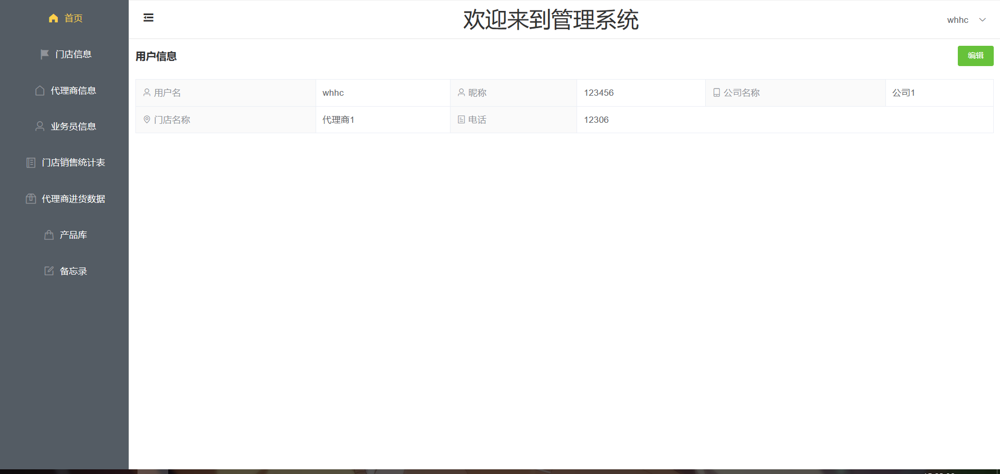
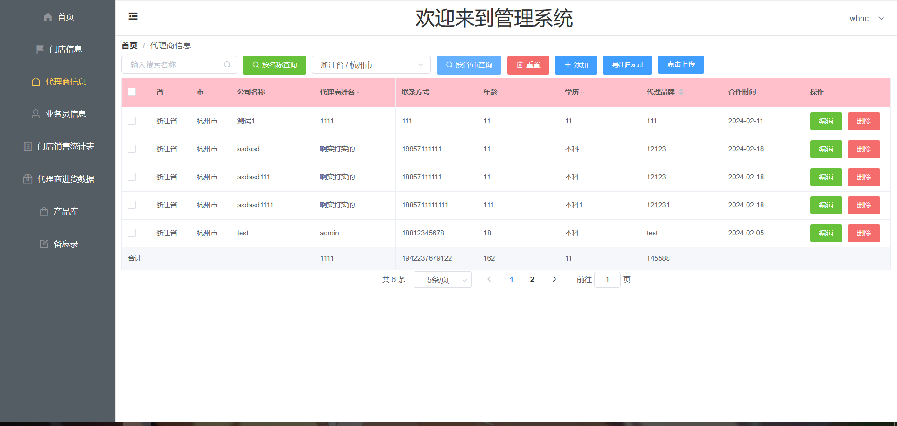
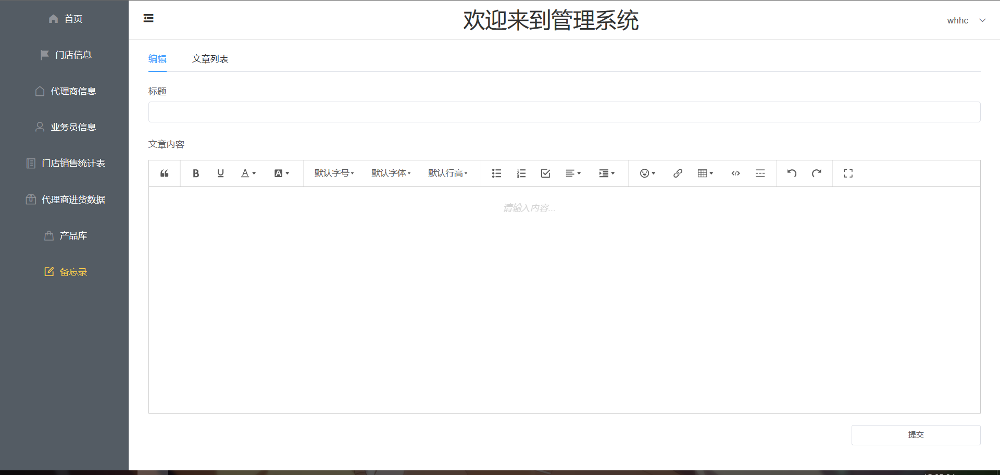
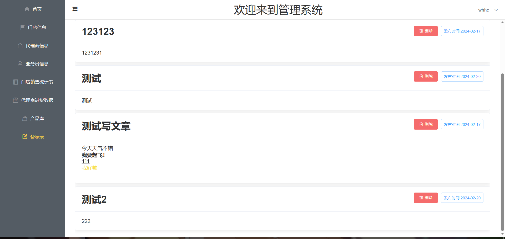

**aopu_web**为前端项目文件，使用VUE编写
**untitled**为后端项目文件，用SpringBoot框架编写
# 门店管理系统

## 技术栈

 `Springboot` +`Vue`，前端页面使用`ElementUI`完成编写，Vue版本为2.x

## 项目介绍

`门店管理系统`项目是一套管理系统，后端数据部分基于`SpringBoot`+`MyBatis`实现，前端管理系统显示页面采用`Vue`+`ElementUI`设计。前台商城系统包含用户登录、用户注册、门店信息、代理商信息、业务员信息、门店销售统计表、代理商进货数据、产品库、**备忘录**等模块。在显示数据的同时还能显示图片。

其中各信息统计表带有Excel的批量导入和批量导出功能，可以更快速地导入数据。

其中备忘录采用[wangEditor](https://www.wangeditor.com/)模块打造，能实现富文本的编辑功能

## 项目截图

首页部分截图演示：

数据显示部分截图：

备忘录截图：

## 组织结构

 aopu_web
 ├── public -- 主页以及图标
 └── src -- Vue代码
 	├── assets -- logo以及全局css
 	├── components -- 组件
 	├── router -- 路由文件
 	├── utils -- 工具包(Html转Excel导出工具)
 	├── App.vue -- 主组件
 	└── main.js -- 启动文件

 untitled

 ├── src.main.java.aopu -- 主java代码
 	├── config-- Springboot配置类文件
 	├── controller -- 控制层
 	├── exception -- Springboto异常处理
 	├── interceptor -- 过滤器，用于检验JWT
 	├── mapper -- mybatis映射接口
 	├── pojo -- 普通 Java 对象，用于对接数据库
 	├── service -- 服务层
 	├── util -- 工具包(JwtUtil)
 	└── AopuApplication.java -- 启动文件

## 技术选型

| 技术       | 说明             | 视频链接                                                     |
| ---------- | ---------------- | ------------------------------------------------------------ |
| Springboot | Web应用开发框架  | https://www.bilibili.com/video/BV1T54y1n7PB                  |
| MyBatis    | ORM框架          | https://www.bilibili.com/video/BV1wy4y1H7wu                  |
| JWT        | JWT登录支持      | https://www.bilibili.com/video/BV1T54y1n7PB                  |
| LomBok     | java语言增强库   | https://github.com/rzwitserloot/lombok                       |
| Vue        | 前端框架         | https://www.bilibili.com/video/BV1Zy4y1K7SH https://www.bilibili.com/video/BV1nV4y1s7ZN |
| ElemenuUI  | 网站快速成型工具 | [Element - 网站快速成型工具](https://element.eleme.io/#/zh-CN) |
| 前端三件套 | 前端三件套       | [黑马程序员](https://space.bilibili.com/37974444)            |

## 搭建步骤

> Windows环境部署

### IDEA

- 关于IDEA的安装与使用请参考：https://github.com/judasn/IntelliJ-IDEA-Tutorial
- 搜索插件仓库，安装插件`Lombok`；

- 将项目下载到本地，然后直接打开。

### Mysql

- 下载并安装mysql`5.7`版本，下载地址：https://dev.mysql.com/downloads/installer/
- 设置数据库帐号密码：root root
- 下载并安装客户端连接工具Navicat，下载地址：http://www.formysql.com/xiazai.html
- 创建数据库`aopu`，导入项目文件夹下的`aopu.sql`文件，初始化数据

- 克隆`AopuDashboard`项目，并导入到IDEA中完成编译

### Node.js

- 仅需安装npm工具即可，安装完成后在aopu_web目录下启动cmd，输入`npm install`,安装完所需依赖后输入`npm run serve`启动前端项目
